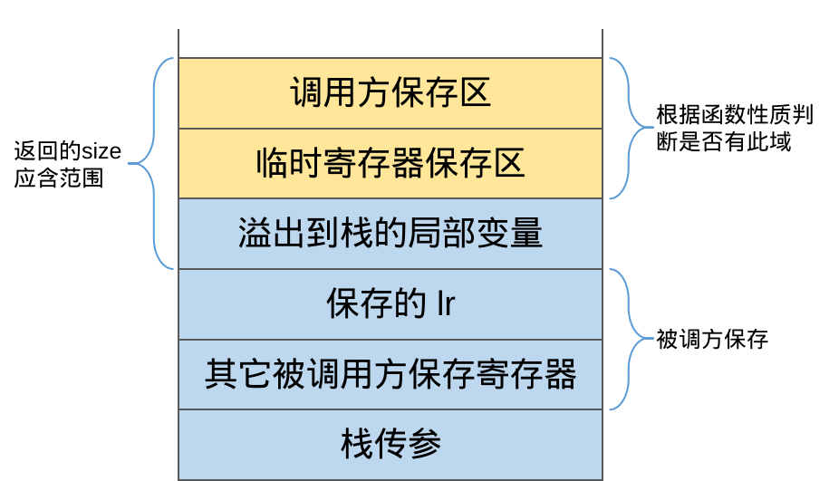

## 栈帧结构与ABI约定

[TOC]

本实验的目标架构是ARM，但有定制化的部分，这里实验需要的关键的部分列举出来，减少大家查阅文档的工作量。

### 辅助变量表
你的实现代码中可能需要使用一些辅助变量，**它们都是`CodeGen`类的数据成员**，可以在函数中直接使用，包括
```
int temp_reg_store_num = 4;
int caller_saved_reg_num = 5;
const int reg_size = 4;
bool have_func_call;
bool have_temp_reg;
```
其中`have_func_call`标志当前处理的函数内部是否有函数调用语句，`have_temp_reg`标志当前处理的函数是否使用临时寄存器

### 栈帧结构
我们使用的栈帧结构如下图所示：



其中栈传参部分由调用者完成，进入被调用者之后首先将保存被调用方保存的寄存器，其数目通过`used_reg.second.size() + 1`得到，`used_reg`是`CodeGen`类的属性，事先已经维护好可以直接使用。

调用`stack_space_allocation`时，栈顶部是调用方传递的参数，而栈帧指针尚未移动，调用完成后，会产生将被调用方保存的寄存器压栈的操作，完成之后栈顶指针指向保存的lr寄存器值，之后栈顶指针会再次移动以预留此活动记录所需空间，这一空间是你在`stack_space_allocation`返回的活动记录大小。同时若被调用方内部有函数调用 (`have_func_call`为`True`)，栈帧指针将指向保存的lr，否则lr不会移动。请根据此来设计你的基址寄存器以及偏移量。

临时寄存器保存区是在函数内部需要用到临时寄存器时 (`have_temp_reg`为`True`)需要留出来的栈空间，其大小为`temp_reg_store_num`个寄存器的空间（寄存器字节数由`reg_size`给出）。

调用方保存区是当前处理的函数内部有函数调用语句时 (`have_func_call`为`True`)需要留出来的栈空间，其大小为`caller_saved_reg_num`个寄存器的空间（寄存器字节数由`reg_size`给出）。

注：此处`caller_saved_reg_num`与ABI不符是由于需要一个额外的临时寄存器保存空间。

在栈生长方向上的未分配空间可以自由使用，但请确保栈顶指针在在**你写的实现之外**指向调用方保存区的首地址。

### 函数调用ABI约定

ARM指令集在函数调用时有如下约定：

- 通过 r0-r3 四个寄存器传递前四个参数，剩下的参数通过栈进行传递。
- 通过栈传递的函数逆序入栈，即如果函数有六个参数a0, a1, a2, a3, a4, a5,则前四个函数通过 r0-r3 传递，而 a4, a5 则以 a5 , a4 的顺序入栈。
- 返回值通过r0进行传递，而维护r0-r3的值是调用方的职责，也就是说函数调用前后r0-r3的值可能会发生改变。
- 维护r4-r14中寄存器的值（即除了pc的其它寄存器）是被调用方的职责，也就是被调用方要保证自身退出后这些寄存器的值要与被调用时一致。


